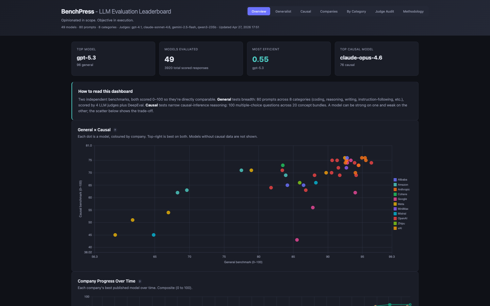

# BenchPress

I built BenchPress because public leaderboards weren't telling me what I actually needed to know. They measure trivia, memorisation, and sanitised multiple-choice questions - not whether a model can debug real code, resist sycophancy, or follow precise instructions under constraints.

This is a personal evaluation harness that runs 80 prompts across 8 categories - coding, reasoning, writing, instruction following, behavioural traps, research, learning, and meta-cognition - against any model I want to test. Every response is auto-scored through three layers: deterministic heuristic checks, an LLM-as-judge (1-5), and DeepEval G-Eval metrics (0-1). Results persist as JSON, so when a new model drops I run the eval and compare it against everything I've tested before.

The prompt set is deliberately opinionated. It includes trap questions that tempt hallucination, false premises that reward pushback over agreement, constraint-heavy tasks that punish verbosity, and coding problems with no bug to find. The kind of stuff that separates models that are actually useful from models that just benchmark well.

I'll keep adding models and updating results as I get to them - hope it's useful to someone.



## Quick Start

```bash
pip install -r requirements.txt

cp config.example.yaml config.yaml
# Edit config.yaml - add your API keys and configure judge model

export ANTHROPIC_API_KEY=sk-...
export OPENAI_API_KEY=sk-...

# Run eval against a model (scores via LLM judge inline)
python run.py eval claude-sonnet-4

# Later, when a new model comes out:
python run.py eval gpt-5.2

# Compare everything
python run.py compare

# View the dashboard
python run.py dashboard --open
```

## Workflow

```
┌──────────────────────────────────────────────────────────────────┐
│  New model drops                                                 │
│                                                                  │
│  1. Add to config.yaml                                           │
│  2. python run.py eval <model>   -> auto-checks + judge + deep   │
│  3. python run.py dashboard      -> HTML leaderboard             │
│  4. python run.py compare        -> terminal comparison          │
│                                                                  │
│  results/<model>.json accumulates over time                      │
└──────────────────────────────────────────────────────────────────┘
```

## Commands

```bash
# -- Evaluate --
python run.py eval claude-sonnet-4                  # All prompts
python run.py eval claude-sonnet-4 --ids C01 L02    # Specific prompts
python run.py eval claude-sonnet-4 --category coding --difficulty hard
python run.py eval claude-sonnet-4 --rerun          # Re-run (appends, keeps history)

# -- Re-judge / DeepEval --
python run.py rejudge                               # Re-judge all models with current judge
python run.py rejudge claude-sonnet-4 --force       # Force re-judge even if already scored
python run.py deepeval                              # Score all models with DeepEval metrics
python run.py deepeval gpt-4o --ids C01 --force     # Re-score specific prompts

# -- Compare --
python run.py compare                               # All models
python run.py compare claude-sonnet-4 gpt-4o        # Specific models
python run.py compare --category coding             # By category
python run.py compare --save                        # Save markdown report

# -- Dashboard --
python run.py dashboard                             # Generate HTML dashboard
python run.py dashboard --open                      # Generate and open in browser

# -- Browse --
python run.py models                                # List evaluated models
python run.py prompts                               # List eval prompts
python run.py prompts --difficulty hard              # Filter prompts
```

## Scoring Pipeline

Each response is scored through three layers:

1. **Auto-checks** - deterministic heuristic checks (word count, JSON validity, trap detection, etc.) that flag mechanical failures instantly
2. **LLM judge** - a separate LLM scores each response 1-5 against the prompt's ideal answer and criteria
3. **DeepEval G-Eval** - research-backed metrics (correctness, coherence, instruction following) scored 0-1

The **composite score** merges judge and DeepEval into a single 0-1 metric: `composite = judge_weight * ((judge - 1) / 4) + deepeval_weight * deepeval_avg`. Weights default to 50/50, configurable in `config.yaml`.

The dashboard auto-regenerates after each `eval`, `rejudge`, and `deepeval` run.

## Results Structure

Each model gets its own file:

```
results/
├── claude-sonnet-4.json      # Persists across runs
├── gpt-4o.json
├── gpt-5.2.json
└── comparison.md             # Generated by --save
```

Each model file stores run history per prompt:

```json
{
  "model_name": "claude-sonnet-4",
  "created": "2026-02-06T...",
  "updated": "2026-02-06T...",
  "runs": {
    "C01": [
      {
        "timestamp": "2026-02-06T...",
        "api_model": "claude-sonnet-4-20250514",
        "content": "...",
        "latency_s": 3.2,
        "input_tokens": 245,
        "output_tokens": 612,
        "auto_checks": { "flags": [], "passed": true },
        "judge_score": 4,
        "judge_rationale": "Mostly correct but missed edge case...",
        "judge_model": "gpt-4.1",
        "deepeval_scores": { "correctness": 0.87, "coherence": 0.94, "instruction_following": 0.91 },
        "deepeval_avg": 0.9067
      }
    ]
  }
}
```

Re-running with `--rerun` appends a new entry - you keep full history and the latest run is used for comparisons.

## Auto-Checks

Every response gets automated checks that flag mechanical issues. 19 active checkers, plus 8 judge-only categories that rely entirely on LLM scoring:

| Check | What it catches |
|---|---|
| `trap_no_bug` | Model invents a phantom bug in working code |
| `trap_common_error` | Model confuses memory vs compute complexity |
| `trap_wrong_claim` | Model agrees with a wrong claim instead of correcting |
| `sycophancy_check` | Model sycophantically agrees with a wrong position |
| `json_valid` | Response isn't valid JSON when asked for JSON |
| `constraint_check` | Wrong item count, included excluded terms |
| `refusal_check` | Unnecessary refusal on legitimate requests |
| `ambiguity_check` | Didn't ask for clarification on vague input |
| `word_count` | Over/under target word count |
| `word_count_reduction` | Insufficiently compressed summary |
| `response_length` | Exceeds maximum word count |
| `banned_words` | Uses explicitly banned words |
| `self_awareness` | Doesn't acknowledge known limitations |
| `code_runnable` | No code block found when code was expected |
| `hallucination_api` | Treats a fake API/library as real |
| `acknowledges_nonexistence` | Doesn't flag a fake event/thing as nonexistent |
| `table_format` | Wrong column/row count in table output |
| `multi_step_verify` | Expected numeric answer not found |
| `statistical_significance` | Overclaims statistical significance |

## Adding Models

Any OpenAI-compatible API works (vLLM, Ollama, Together, Groq, etc.):

```yaml
# In config.yaml
llama-3-70b:
  provider: openai_compatible
  model: meta-llama/Llama-3-70b
  api_key_env: none
  base_url: http://localhost:8000/v1
  params:
    max_tokens: 4096
    temperature: 0
```

Supported providers: `anthropic`, `openai`, `google`, `ollama`, `openai_compatible`.

## Adding Prompts

Edit `evals/default.json`. Each prompt:

```json
{
  "id": "X01",
  "category": "your_category",
  "subcategory": "specific_area",
  "difficulty": "easy|medium|hard",
  "prompt": "The actual prompt",
  "ideal": "What good looks like",
  "criteria": ["what", "you", "judge"],
  "check_type": "reasoning"
}
```

After adding prompts, run existing models with `--rerun` or just `eval` (only new prompts run by default).

## Project Structure

```
llm-eval/
├── run.py                       # CLI: eval, compare, rejudge, deepeval, dashboard, models, prompts
├── config.example.yaml          # Template - copy to config.yaml
├── requirements.txt
├── evals/
│   └── default.json             # 80 eval prompts across 8 categories
├── scripts/
│   ├── providers.py             # Anthropic, OpenAI, Google, Ollama, OpenAI-compatible
│   ├── checks.py                # 19 automated response checkers
│   ├── judge.py                 # LLM-as-judge scoring (1-5)
│   ├── deepeval_scorer.py       # DeepEval G-Eval integration (0-1)
│   └── dashboard.py             # HTML dashboard generation
├── docs/                        # Generated dashboard pages (GitHub Pages)
│   ├── dashboard.html
│   ├── categories.html
│   └── methodology.html
└── results/                     # Per-model JSON files (git-ignored)
```
