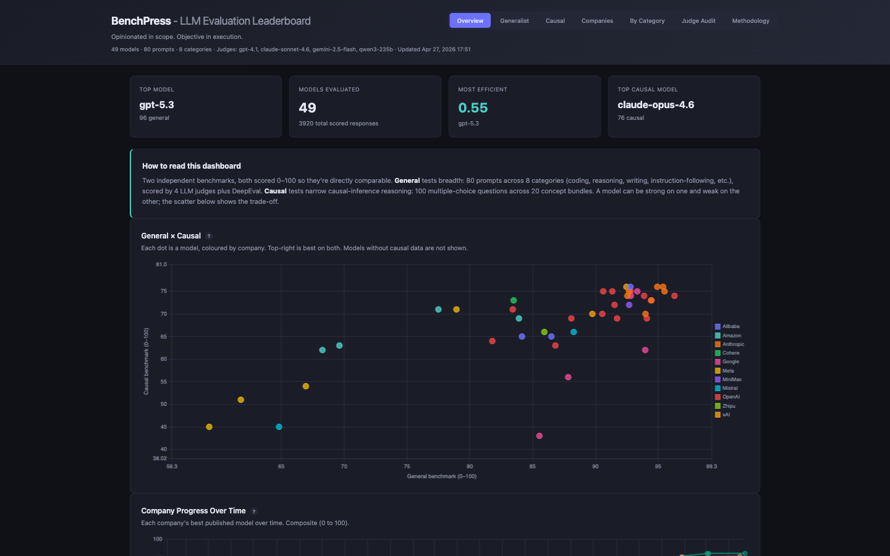

# BenchPress

**Opinionated LLM evaluation for real-world use.**


**Live dashboard:** [mark-allwyn.github.io/BenchPress](https://mark-allwyn.github.io/BenchPress/)

BenchPress runs two independent benchmark suites against any LLM:

**Generalist** (80 prompts, 8 categories) - trap questions, false premises, constraint-heavy tasks, coding problems with no bug to find. Scored through three layers: deterministic auto-checks, multi-judge LLM scoring (1-5 normalised to 0-100), and DeepEval G-Eval metrics (correctness, coherence, instruction-following, 0-100).

**Causal Reasoning v2.4** (100 questions, 20 bundles) - adversarial multiple-choice questions testing whether models truly understand causal inference or just pattern-match. Each bundle has 5 variants: base scenario, trap (the obvious answer is wrong), formal DAG reasoning with short elimination-style options, multi-step numeric, and analyst debate. Four rounds of structural hardening eliminated length bias and keyword tells. Scored deterministically, no LLM judge or DeepEval involvement.

Both benchmarks display 0-100 and are reported side by side. They are never blended into a single number. Results persist as JSON, so when a new model drops, one command compares it against everything tested before.



## Features

- **Two benchmark suites** - Generalist (80 prompts, open-ended) and Causal Reasoning (100 multiple-choice, bundled)
- **Three-layer scoring** (Generalist) - heuristic auto-checks, multi-judge LLM scoring, and DeepEval G-Eval metrics combined into a composite score
- **Per-variant accuracy** (Causal) - 20 bundles × 5 variants each, exposing pattern-matching vs structural reasoning per model
- **Multi-judge consensus** - multiple independent LLM judges score each response, with self-judging prevented and agreement/divergence tracking
- **49 models, 12 companies** - Anthropic, OpenAI, Google, Meta, xAI, Mistral, Alibaba, Zhipu, Moonshot, MiniMax, Cohere, Amazon
- **20 automated checkers** - trap detection, sycophancy checks, constraint validation, hallucination flags, multiple-choice scoring, and more
- **Interactive dashboard** - sortable leaderboard with per-category breakdowns, company views, causal reasoning page, and methodology docs
- **Any OpenAI-compatible API** - works with vLLM, Ollama, Together, Groq, HF Inference API, and others
- **Append-only history** - re-runs append new entries, full history preserved per prompt

## Quick Start

```bash
pip install -r requirements.txt

cp config.example.yaml config.yaml
# Edit config.yaml - add your API keys and configure judge model

export ANTHROPIC_API_KEY=sk-...
export OPENAI_API_KEY=sk-...

# Run general eval against a model
python run.py eval claude-sonnet-4

# Run causal reasoning benchmark
python run.py eval claude-sonnet-4 --benchmark causal

# Compare everything
python run.py compare

# View the dashboard
python run.py dashboard --open
```

## Scoring Pipeline

Each response is scored through three layers:

1. **Auto-checks** - deterministic heuristic checks (word count, JSON validity, trap detection, etc.) that flag mechanical failures instantly
2. **LLM judges** - multiple independent LLM judges each score responses 1-5 against the prompt's ideal answer and criteria
3. **DeepEval G-Eval** - research-backed metrics (correctness, coherence, instruction following) scored 0-1

The **composite score** merges judge and DeepEval into a single 0-1 metric:

```
composite = judge_weight * ((judge - 1) / 4) + deepeval_weight * deepeval_avg
```

Weights default to 50/50, configurable in `config.yaml`. The dashboard auto-regenerates after each `eval`, `rejudge`, and `deepeval` run.

## Commands

| Command | Description |
|---|---|
| `python run.py eval <model>` | Run Generalist benchmark against a model |
| `python run.py eval <model> --benchmark causal` | Run causal reasoning benchmark |
| `python run.py eval <model> --benchmark all` | Run both benchmarks |
| `python run.py eval <model> --ids C01 L02` | Run specific prompts |
| `python run.py eval <model> --category coding` | Filter by category |
| `python run.py eval <model> --rerun` | Re-run (appends, keeps history) |
| `python run.py rejudge` | Re-judge all models with current judge |
| `python run.py rejudge --benchmark causal` | Re-judge causal benchmark |
| `python run.py deepeval` | Score all models with DeepEval metrics |
| `python run.py compare` | Compare all models |
| `python run.py compare --benchmark causal` | Compare causal results |
| `python run.py compare --save` | Save markdown report |
| `python run.py dashboard` | Generate HTML dashboard |
| `python run.py dashboard --open` | Generate and open in browser |
| `python run.py models` | List evaluated models |
| `python run.py prompts` | List Generalist eval prompts |
| `python run.py prompts --benchmark causal` | List causal prompts |

## Models Evaluated

49 models across 12 companies. All ran on Generalist; 5 are excluded from Causal (retired APIs, paid-tier-only, broken HF model paths).

<details>
<summary>Full model list</summary>

| Model | Company | Launched |
|---|---|---|
| claude-opus-4.7 | Anthropic | 2026-04-14 |
| claude-opus-4.6 | Anthropic | 2026-01-28 |
| claude-sonnet-4.6 | Anthropic | 2026-01-28 |
| claude-opus-4.5 | Anthropic | 2025-11-01 |
| claude-sonnet-4.5 | Anthropic | 2025-09-29 |
| claude-opus-4 | Anthropic | 2025-05-14 |
| claude-sonnet-4 | Anthropic | 2025-05-14 |
| claude-sonnet-3.7 | Anthropic | 2025-02-19 |
| claude-haiku-3 | Anthropic | 2024-03-07 |
| gpt-5.5 | OpenAI | 2026-04-23 |
| gpt-5.4 | OpenAI | 2026-03-05 |
| gpt-5.3 | OpenAI | 2026-03-03 |
| gpt-5.2 | OpenAI | 2025-12-01 |
| gpt-5.1 | OpenAI | 2025-11-01 |
| gpt-oss-120b | OpenAI | 2025-07-01 |
| gpt-oss-20b | OpenAI | 2025-07-01 |
| o4-mini | OpenAI | 2025-04-16 |
| gpt-4.1 | OpenAI | 2025-04-14 |
| gpt-4.1-mini | OpenAI | 2025-04-14 |
| gpt-4.1-nano | OpenAI | 2025-04-14 |
| o3-mini | OpenAI | 2025-01-31 |
| gpt-4o | OpenAI | 2024-05-13 |
| gpt-4o-mini | OpenAI | 2024-07-18 |
| gemini-3.1-pro | Google | 2026-01-01 |
| gemini-3-pro | Google | 2025-09-01 |
| gemini-3-flash | Google | 2025-09-01 |
| gemini-2.5-flash | Google | 2025-05-20 |
| gemma-3-27b | Google | 2025-03-12 |
| grok-4.1-fast | xAI | 2025-10-01 |
| grok-4 | xAI | 2025-07-09 |
| llama-4-scout | Meta | 2025-04-05 |
| llama-4-maverick | Meta | 2025-04-05 |
| llama3.2 | Meta | 2024-09-25 |
| llama3.2-vision-11b | Meta | 2024-09-25 |
| llama3.1 | Meta | 2024-07-23 |
| qwen3-235b | Alibaba | 2025-07-01 |
| qwen3-coder-30b | Alibaba | 2025-07-01 |
| qwen3-32b | Alibaba | 2025-04-29 |
| minimax-m2.5 | MiniMax | 2025-10-01 |
| kimi-k2.5 | Moonshot | 2025-10-01 |
| glm-5 | Zhipu | 2025-10-01 |
| glm-4.7-flash | Zhipu | 2025-06-01 |
| mistral-large-3 | Mistral | 2025-03-01 |
| codestral | Mistral | 2024-05-29 |
| command-a | Cohere | 2025-03-01 |
| nova-2-lite | Amazon | 2025-06-01 |
| nova-pro | Amazon | 2024-12-03 |
| nova-lite | Amazon | 2024-12-03 |
| nova-micro | Amazon | 2024-12-03 |

</details>

## Causal Reasoning Benchmark

100 multiple-choice questions across 20 bundles, each covering a core causal-inference pitfall (confounding + selection, M-bias, Berkson's bias, time-varying confounding, transportability, etc). Every bundle has 5 variant types:

| Variant | What it tests |
|---|---|
| **Base** | Narrative scenario combining 2-3 interacting causal issues |
| **Trap** | Looks like the base concept applies but the obvious answer is wrong; tests when a principle does NOT apply |
| **Transfer** | Formal DAG reasoning with short elimination-style answers (set notation, path counts, yes/no) |
| **Numeric** | Multi-step calculation with tables and conditional probabilities |
| **Analyst** | Two analysts debate - pick the most accurate assessment |

Scoring dimensions:
- **Raw accuracy** - % of 100 questions correct
- **Variant accuracy** - per-variant accuracy across all 20 bundles (reveals which causal skill a model is weakest at)
- **Bundle consistency** - how many of 5 variants correct per bundle (exposes pattern-matching vs genuine understanding)
- **Invalid rate** - responses that don't produce a valid A/B/C/D answer

Because answers are deterministic, this benchmark skips LLM-judge and DeepEval scoring. Set per-benchmark scoring in `config.yaml`:

```yaml
eval:
  benchmark_scoring:
    causal:
      skip_judges: true
      skip_deepeval: true
```

Run against the causal set:

```bash
python run.py eval <model-name> --benchmark causal
```

Causal questions are not published, to prevent models being tuned to this specific benchmark. Hardening design document: [`docs/plans/2026-04-10-causal-benchmark-v2-harder.md`](docs/plans/2026-04-10-causal-benchmark-v2-harder.md).

### Hardening history

The v2.4 transfer variant is the result of four iterations against a cheap baseline model (Claude Haiku 3). Each round exposed a structural tell that let models score high without reasoning:

| Version | Change | Haiku transfer | Opus transfer |
|---|---|---|---|
| v2.0 | Initial release | 90% | 90% |
| v2.1 | Content hardening (more distractors) | 90% | 90% |
| v2.2 | Length normalisation | 90% | 90% |
| v2.3 | Narrative replaced with paragraph-long DAG questions | 85% | **100%** (saturated) |
| **v2.4** | **Elimination-style short options (set notation, counts)** | **40%** | **55%** |

The key insight: when all 4 options are similar short length (20-80 chars), length-based heuristics fail and the question forces actual DAG traversal.

## Auto-Checks

20 active checkers, plus 8 judge-only categories that rely entirely on LLM scoring:

| Check | What it catches |
|---|---|
| `trap_no_bug` | Model invents a phantom bug in working code |
| `trap_common_error` | Model confuses memory vs compute complexity |
| `trap_wrong_claim` | Model agrees with a wrong claim instead of correcting |
| `sycophancy_check` | Model sycophantically agrees with a wrong position |
| `json_valid` | Response isn't valid JSON when asked for JSON |
| `constraint_check` | Wrong item count, included excluded terms |
| `refusal_check` | Unnecessary refusal on legitimate requests |
| `ambiguity_check` | Didn't ask for clarification on vague input |
| `word_count` | Over/under target word count |
| `word_count_reduction` | Insufficiently compressed summary |
| `response_length` | Exceeds maximum word count |
| `banned_words` | Uses explicitly banned words |
| `self_awareness` | Doesn't acknowledge known limitations |
| `code_runnable` | No code block found when code was expected |
| `hallucination_api` | Treats a fake API/library as real |
| `acknowledges_nonexistence` | Doesn't flag a fake event/thing as nonexistent |
| `table_format` | Wrong column/row count in table output |
| `multi_step_verify` | Expected numeric answer not found |
| `statistical_significance` | Overclaims statistical significance |
| `multiple_choice` | Extracts answer letter and checks against correct answer |

## Configuration

### Adding Models

Any OpenAI-compatible API works (vLLM, Ollama, Together, Groq, HF Inference API, etc.):

```yaml
# In config.yaml
llama-3-70b:
  provider: openai_compatible
  model: meta-llama/Llama-3-70b
  company: Meta
  launch_date: "2024-04-18"
  api_key_env: none
  base_url: http://localhost:8000/v1
  params:
    max_tokens: 4096
    temperature: 0
```

Supported providers: `anthropic`, `openai`, `google`, `ollama`, `bedrock`, `cohere`, `openai_compatible`.

### Adding Prompts

Edit `evals/general.json` for general prompts or `evals/causal.json` for causal reasoning. Each general prompt:

```json
{
  "id": "X01",
  "category": "your_category",
  "subcategory": "specific_area",
  "difficulty": "easy|medium|hard",
  "prompt": "The actual prompt",
  "ideal": "What good looks like",
  "criteria": ["what", "you", "judge"],
  "check_type": "reasoning"
}
```

After adding prompts, run existing models with `--rerun` or just `eval` (only new prompts run by default).

### Results Structure

Each model gets its own JSON file in `results/`:

```json
{
  "model_name": "claude-sonnet-4",
  "created": "2026-02-06T...",
  "updated": "2026-02-06T...",
  "runs": {
    "C01": [
      {
        "timestamp": "2026-02-06T...",
        "api_model": "claude-sonnet-4-20250514",
        "content": "...",
        "latency_s": 3.2,
        "input_tokens": 245,
        "output_tokens": 612,
        "auto_checks": { "flags": [], "passed": true },
        "judge_scores": {
          "gpt-4.1": {
            "score": 4,
            "rationale": "Mostly correct but missed edge case...",
            "judged_at": "2026-02-06T10:01:00"
          }
        },
        "judge_score_avg": 4.0,
        "judge_count": 1,
        "deepeval_scores": { "correctness": 0.87, "coherence": 0.94, "instruction_following": 0.91 },
        "deepeval_avg": 0.9067
      }
    ]
  }
}
```

Re-running with `--rerun` appends a new entry; the latest run is used for comparisons.

## Project Structure

```
llm-eval/
├── run.py                       # CLI: eval, compare, rejudge, deepeval, dashboard, models, prompts
├── config.example.yaml          # Template - copy to config.yaml
├── requirements.txt
├── evals/
│   ├── general.json             # 80 general eval prompts across 8 categories
│   └── causal.json              # 100 causal reasoning questions in 20 bundles
├── scripts/
│   ├── providers.py             # Anthropic, OpenAI, Google, Ollama, Bedrock, Cohere, OpenAI-compatible
│   ├── checks.py                # 20 automated response checkers
│   ├── judge.py                 # LLM-as-judge scoring (1-5)
│   ├── deepeval_scorer.py       # DeepEval G-Eval integration (0-1)
│   └── dashboard.py             # HTML dashboard generation
├── docs/                        # Generated dashboard pages (GitHub Pages-ready)
│   ├── index.html               # Overview: scatter, timeline, top 10s, link cards
│   ├── generalist.html          # Generalist benchmark deep-dive
│   ├── causal.html              # Causal reasoning benchmark deep-dive
│   ├── companies.html
│   ├── categories.html
│   ├── judges.html              # Judge audit (agreement, divergence, bias)
│   ├── methodology.html
│   ├── data.json                # Shared dataset, fetched on page load
│   ├── causal-data.json
│   ├── sitemap.xml, robots.txt, favicon.svg, og-card.png
└── results/                     # Per-model JSON files (tracked in git)
```

## License

MIT
